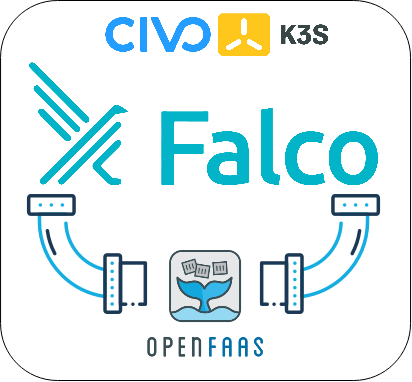

# Kubernetes Response Engine powered by OpenFaaS

Although Falco can be used to detect any _intrusion_ attempts and sends alerts to channels according to the given rules
afterwards, it does not have any _remediation_ system. This is why we need something called Kubernetes Response Engine.
It simply aims to catch alerts and take actions on it. These actions can be designed as _fine-grained_ serverless
functions.

🎁 Table of Contents
=================
<!-- START doctoc generated TOC please keep comment here to allow auto update -->
<!-- DON'T EDIT THIS SECTION, INSTEAD RE-RUN doctoc TO UPDATE -->

- ⛺ [Overall Architecture](#overall-architecture)
- 🧰 [Prerequisites](#prerequisites)
- 🎯 [Target Audience](#target-audience)
- 🎁 [What is ...?](#what-is-)
    - [CIVO](#civo)
    - [K3S](#k3s)
    - [Falco](#falco)
    - [OpenFaaS](#openfaas)
-  👨‍💻[Hands-on Demonstration](#hands-on-demonstration)

<!-- END doctoc generated TOC please keep comment here to allow auto update -->

# Overall Architecture

```bash
                                              +-----------+
                                              |   Falco   +
                                              +-----^-----+
                                                    |
                                            +-------v-------+
                                            >   OpenFaaS    +
                                            +-------v-------+
                              +-----------+         |          +-----------+
                              | notify-fn <---------+----------> delete-fn |
                              +-----v-----+ notice     warning +-----+-----+
                                    |                                |
                                    | send alert          delete pod |
                                    |                                |
                              +-----v-----+                    +-----v-----+       
                              |   Slack   |                    | Pwned Pod |
                              +-----------+                    +-----------+
   ```

# Prerequisites

*  civo cli v0.7.6
*  Helm v3.5.1
*  faas-cli
*  kubectl v1.20.2

> We are going to do this demo on macOS Catalina 1.15.7, you can find the prerequisites on [brew](https://brew.sh).

# Target Audience

If you want to:

* Set up a K3S cluster on CIVO
* Set up the Falco
* Create custom serverless functions using OpenFaaS
* Subscribe Falco events from serverless functions

# What is ...?

## [CIVO](https://www.civo.com/)

_Built for speed and simplicity, with K3s under the hood_

**Join the [#Kube100](https://www.civo.com/kube100) beta: [Apply to join today](https://www.civo.com/signup) _(Get free
credit to test-drive the world’s first K3s-powered, managed Kubernetes service)_**

* Fast, but powerful

> Spin up Kubernetes in under 2 minutes, without the bloat, using the lightweight K3s distribution

* Management CLI

> Manage your clusters with our custom-built CLI. Streamline deploys with our clean REST API.

* Application marketplace

> Launch clusters with preinstalled applications, or install on the fly with our Kubernetes marketplace.

## [K3S](https://k3s.io/)

_The certified Kubernetes distribution built for IoT & Edge computing_

* Perfect for Edge

> K3s is a highly available, certified Kubernetes distribution designed for production workloads in unattended, resource-constrained, remote locations or inside IoT appliances. Simplified & Secure

* Simplified & Secure

> K3s is packaged as a single <40MB binary that reduces the dependencies and steps needed to install, run and auto-update a production Kubernetes cluster.

* Optimized for ARM

> Both ARM64 and ARMv7 are supported with binaries and multiarch images available for both. K3s works great from something as small as a Raspberry Pi to an AWS a1.4xlarge 32GiB server.

## [Falco](https://falco.org/)

_Cloud-Native runtime security, de facto Kubernetes threat detection engine_

* Strengthen container security

> The flexible rules engine allows you to describe any type of host or container behavior or activity.

* Reduce risk via immediate alerts

> You can immediately respond to policy violation alerts and integrate Falco within your response workflows.

* Leverage most current detection rules

> Falco out-of-the box rules alert on malicious activity and CVE exploits.

## [OpenFaaS](https://www.openfaas.com/)

_OpenFaaS® makes it simple to deploy both functions and existing code to Kubernetes_

* Anywhere

> Avoid lock-in through the use of Docker. Run on any public or private cloud.

* Any code

> Build both microservices & functions in any language. Legacy code and binaries.

* Any scale

> Auto-scale for demand or to zero when idle.

# Hands-on Demonstration

## Create CIVO Playground

* Save an API Key on [Security Dashboard](https://www.civo.com/account/security)


```bash
$ civo apikey save my-awesome-key $KEY
Saved the API Key $KEY as my-awesome-key
```

```bash
$ civo apikey list
+----------------+---------+
| Name           | Default |
+----------------+---------+
| my-awesome-key | $KEY    |
+----------------+---------+
```

```bash
$ civo apikey current my-awesome-key
Set the default API Key to be my-awesome-key
```

* Create a cluster

```bash
$ civo kubernetes create playground --size=g3.k3s.medium --nodes=3 --region NYC1 --wait
Created Kubernetes cluster playground
```

* Show the playground on [Kubernetes Dashboard](https://www.civo.com/account/kubernetes)

```bash
$ civo kubernetes show playground
          ID : 79435efe-2dac-403d-bfd2-f6644988830a
        Name : playground
       Nodes : 3
        Size : g3.k3s.medium
      Status : ACTIVE
     Version : 1.20.0-k3s2
API Endpoint : https://212.2.243.151:6443
   Master IP : 212.2.243.151
DNS A record : 79435efe-2dac-403d-bfd2-f6644988830a.k8s.civo.com
Nodes:
+-------------+---------------+--------+---------------+-----------+------+----------+
| Name        | IP            | Status | Size          | Cpu Cores | Ram  | SSD disk |
+-------------+---------------+--------+---------------+-----------+------+----------+
| master-7c8a | 212.2.243.151 | ACTIVE | g3.k3s.medium |         2 | 4096 |       25 |
| node-04ed   |               | ACTIVE | g3.k3s.medium |         2 | 4096 |       25 |
| node-5258   |               | ACTIVE | g3.k3s.medium |         2 | 4096 |       25 |
+-------------+---------------+--------+---------------+-----------+------+----------+
```


* Configure the playground

```bash
$ civo kubernetes config playground --save --local-path ./kubeconfig
Access your cluster with:
KUBECONFIG=./kubeconfig kubectl get node
```

* Ensure all is OK

```bash
$ export KUBECONFIG=./kubeconfig
$ kubectl get node
NAME                                  STATUS   ROLES                  AGE   VERSION
k3s-playground-66b18d51-node-04ed     Ready    <none>                 40h   v1.20.2+k3s1
```

You can find more details about **civo cli** [here](https://github.com/civo/cli).

* Set up OpenFaaS

```bash
$ helm upgrade openfaas --install openfaas/openfaas \
    --namespace openfaas --create-namespace \
    -f openfaas-override.yaml
Release "openfaas" does not exist. Installing it now.
NAME: openfaas
LAST DEPLOYED: Thu Mar  4 14:28:32 2021
NAMESPACE: openfaas
STATUS: deployed
REVISION: 1
TEST SUITE: None
NOTES:
To verify that openfaas has started, run:

  kubectl -n openfaas get deployments -l "release=openfaas, app=openfaas"
```

* Set up Falco

```bash
$ helm upgrade falco --install falcosecurity/falco \
--namespace falco --create-namespace \
-f override.yaml
WARNING: Kubernetes configuration file is group-readable. This is insecure. Location: ./kubeconfig
WARNING: Kubernetes configuration file is world-readable. This is insecure. Location: ./kubeconfig
Release "falco" does not exist. Installing it now.
NAME: falco
LAST DEPLOYED: Thu Mar  4 14:34:54 2021
NAMESPACE: falco
STATUS: deployed
REVISION: 1
TEST SUITE: None
NOTES:
Falco agents are spinning up on each node in your cluster. After a few
seconds, they are going to start monitoring your containers looking for
security issues.


No further action should be required.


Tip:
You can easily forward Falco events to Slack, Kafka, AWS Lambda and more with falcosidekick.
Full list of outputs: https://github.com/falcosecurity/charts/falcosidekick.
You can enable its deployment with `--set falcosidekick.enabled=true` or in your values.yaml.
See: https://github.com/falcosecurity/charts/blob/master/falcosidekick/values.yaml for configuration values.
```

After everyting is ok, we should configure our faas-cli to be able deploy functions.

```bash
export OPENFAAS_URL="http://79435efe-2dac-403d-bfd2-f6644988830a.k8s.civo.com:31112"
```

Let's see what functions that we have.

```bash
$ faas-cli list
Function                        Invocations     Replicas
```

You should see nothing.

> NOTE: Don't forget to change Docker ID in the function's description files.

Let's deploy our functions.

```bash
$ faas-cli up -f dispatch-fn.yml
$ faas-cli up -f notifier-fn.yml
$ faas-cli up -f delete-pod-fn.yml
...
```

Once it's completed, you should see the pods that's running on  `openfaas-fn` namespace, and you should also see
functions by typing `faas-cli list` command.

```bash
$ faas-cli list
Function                        Invocations     Replicas
dispatch-fn                     37              1
notifier-fn                     23              1
delete-pod-fn                   0               1

$ kubectl get pods --namespace=openfaas-fn
Found existing alias for "kubectl get pods". You should use: "kgp"
NAME                             READY   STATUS    RESTARTS   AGE
dispatch-fn-b5b68df77-r7crl      1/1     Running   0          7m23s
notifier-fn-5fd846c887-hgpf4     1/1     Running   0          4m48s
delete-pod-fn-55cc89965c-fs55q   1/1     Running   0          37s
```

If everything works well, you should see the Slack messages in the #falco-alert channel. Here is the screenshot above
that shows this.
> Learn more about how you can set up a Slack workspace from this [link](https://slack.com/intl/en-tr/help/articles/206845317-Create-a-Slack-workspace).


The next thing that we need to do this, we should create an alert at _Warning_ level, in order to that, we need to
create a Pod based on the alpine image, and we should connect to it, and access some important folders like _
/etc/shadow_. Once we do this, we should notice that our Pod gets killed by the _delete-pod-fn_ function.

Let's test it with creating a Pod.

```bash
$  kubectl run alpine -n default --image=alpine --restart='Never' -- sh -c "sleep 600"
Found existing alias for "kubectl". You should use: "k"
pod/alpine created
```

Connect to it.
```bash
$ kubectl exec -ti alpine -- sh
Found existing alias for "kubectl exec -ti". You should use: "keti"
/ #
```

Once you connect it, open a second terminal and watch the state of the Pod.

```bash
$ watch kubectl get pods
Every 2.0s: kubectl get pods
NAME     READY   STATUS    RESTARTS   AGE
alpine   1/1     Running   0          106s
```

Then, in the first terminal, run the `cat /etc/shadow`, then look at the second terminal, you should notice that Pod's
status changed from _Running_ to _Terminating_, and your connection to the Pod is lost.

