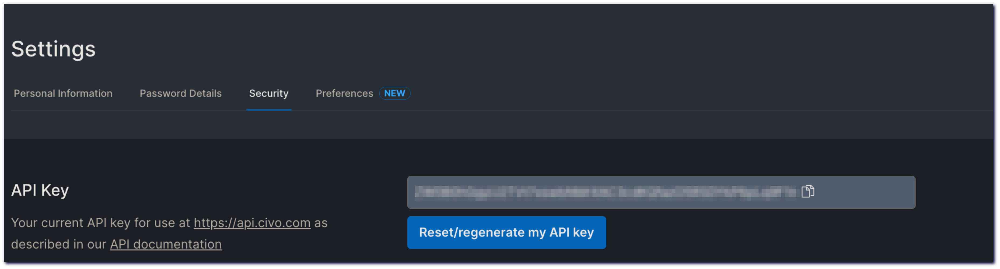
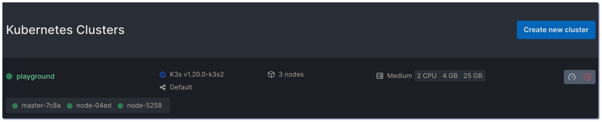
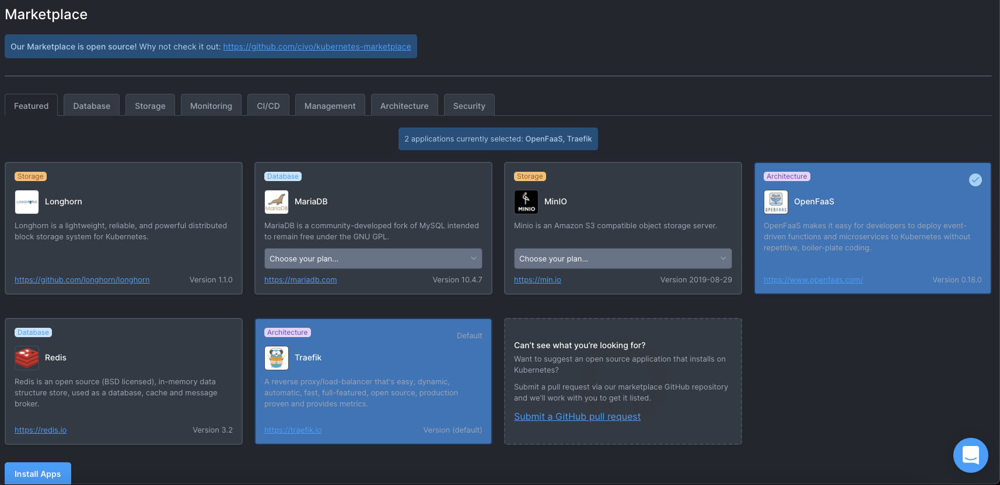
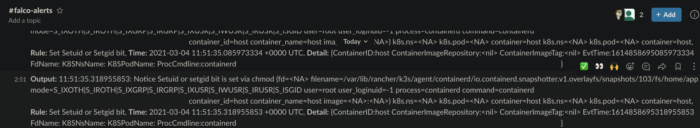
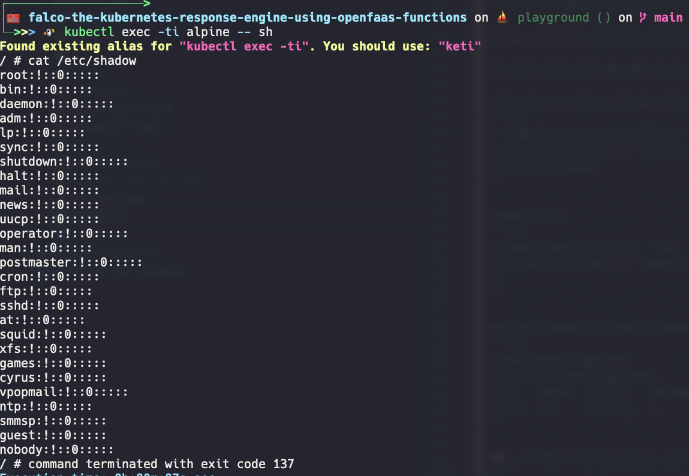

<p align="center">  </p>

[](https://www.openfaas.com)
[](https://k3s.io)
[](https://falco.org)
[![CIVO](https://img.shields.io/badge/civo-blue.svg?logo=data:image/svg+xml;base64,PD94bWwgdmVyc2lvbj0iMS4wIiBlbmNvZGluZz0idXRmLTgiPz4NCjwhLS0gR2VuZXJhdG9yOiBBZG9iZSBJbGx1c3RyYXRvciAxNi4wLjQsIFNWRyBFeHBvcnQgUGx1Zy1JbiAuIFNWRyBWZXJzaW9uOiA2LjAwIEJ1aWxkIDApICAtLT4NCjwhRE9DVFlQRSBzdmcgUFVCTElDICItLy9XM0MvL0RURCBTVkcgMS4xLy9FTiIgImh0dHA6Ly93d3cudzMub3JnL0dyYXBoaWNzL1NWRy8xLjEvRFREL3N2ZzExLmR0ZCI+DQo8c3ZnIHZlcnNpb249IjEuMSIgaWQ9IkxheWVyXzEiIHhtbG5zPSJodHRwOi8vd3d3LnczLm9yZy8yMDAwL3N2ZyIgeG1sbnM6eGxpbms9Imh0dHA6Ly93d3cudzMub3JnLzE5OTkveGxpbmsiIHg9IjBweCIgeT0iMHB4Ig0KCSB3aWR0aD0iNzExLjM2NHB4IiBoZWlnaHQ9IjIzOC4xOTNweCIgdmlld0JveD0iMCAwIDcxMS4zNjQgMjM4LjE5MyIgZW5hYmxlLWJhY2tncm91bmQ9Im5ldyAwIDAgNzExLjM2NCAyMzguMTkzIg0KCSB4bWw6c3BhY2U9InByZXNlcnZlIj4NCjxnPg0KCTxwYXRoIGZpbGw9IiMyMzlERkYiIGQ9Ik0yNzMuNTM5LDAuMDgxaC0yOS40MjRjLTUuNDI0LDAtOC45ODEsNC4xNzktOC45ODEsOS40MjN2MjE5LjEzYzAsNS4yNDUsMy41NTcsOS40NDcsOC45ODEsOS40NDdoMjkuNDI0DQoJCWM1LjQyNCwwLDkuNTk1LTQuMjAyLDkuNTk1LTkuNDQ3VjkuNTA0QzI4My4xMzQsNC4yNiwyNzguOTYzLDAuMDgxLDI3My41MzksMC4wODEiLz4NCgk8cGF0aCBmaWxsPSIjMjM5REZGIiBkPSJNMTgxLjY2MiwxNzMuMTIyYy0yLjY3MS01Ljg1OS0xMC4zMjctNy40NzMtMTUuMDI3LTMuMDcyYy0xMi40NDYsMTEuNjU4LTI5LjEzNiwxOC44MTktNDcuNTM4LDE4LjgxOQ0KCQljLTQ4LjIxOCwwLTg1LjAxMi00OC45MDktNjMuNDc3LTk5LjgyNGM2LjM2NS0xNS4wNDksMTguNDQyLTI3LjA5MiwzMy40OTUtMzMuNDQ3YzI5LjQyMS0xMi40MjEsNTguMDQ4LTUuMzQ1LDc3LjAzNywxMi4wOTUNCgkJYzQuNzQ5LDQuMzYxLDEyLjM2NSwyLjgxNCwxNS4wNC0zLjA1NGwxMi43NDQtMjcuOTU2YzIuMDM5LTQuNDc0LDAuNjMxLTkuNzIxLTMuMjkyLTEyLjY4NQ0KCQlDMTYwLjc4OSwxLjQzNywxMjAuMDM3LTcuNDIsNzcuNTYyLDcuMDUyQzQzLjQ3MiwxOC42NjYsMTYuODksNDYuMTU0LDYuMDY1LDgwLjUwM2MtMjUuODk0LDgyLjE2MywzNC43NDksMTU3LjY5LDExMy4wMzIsMTU3LjY5DQoJCWMyNy4yNDUsMCw1Mi4yODYtOS4yMTQsNzIuMzI3LTI0LjYzM2MzLjc4Ni0yLjkxMyw0Ljk3My04LjExMywyLjk5MS0xMi40NjJMMTgxLjY2MiwxNzMuMTIyeiIvPg0KCTxwYXRoIGZpbGw9IiMyMzlERkYiIGQ9Ik03MDUuMjk5LDgwLjUwM2MtMTAuODI1LTM0LjM0OS0zNy40MDctNjEuODM3LTcxLjQ5Ny03My40NTFjLTI0LjEyOC04LjIyMS00Ny42OTgtOC45MDYtNjkuMDMzLTMuODM1DQoJCWMtMzUuNTg1LDcuOTQ2LTYxLjM1OCwyNC44MTctODQuMDEsNzMuNDUzbC00NS40NTUsOTguNTk4TDM1OC4xNSw1LjY2N2MtMS41NDEtMy4zODEtNC45MTEtNS41NTQtOC42MjYtNS41NmwtMzMuNzA2LTAuMDUzDQoJCWMtNi45MTctMC4wMTEtMTEuNTI0LDcuMTQyLTguNjUzLDEzLjQzNmwxMDAuMDY0LDIxOC43OWMxLjU0MiwzLjM4Myw0LjkxNyw1LjY3LDguNjM0LDUuNjcxbDEuNjM3LDAuMTMxaDM3Ljg0MQ0KCQljMC43NjEsMCwxLjUyMi0wLjE1NywyLjI0NC0wLjQwM2MyLjYwNC0wLjg4Nyw0Ljc5OC0yLjc0NSw1LjkzOC01LjMxMWMwLDAsNTAuMDk4LTExNC4wMjcsNTAuNjgxLTExNS40MDINCgkJYzE1LjI0NC0zNS45NDksMjQuNDk1LTUwLjkyMiw0OC42OTEtNjEuMjA2YzE4LjMwNy03Ljc4LDM5Ljk1NS04LjcyNyw2MC44ODUsMC43NTNjMTQuNTcsNi41OTksMjYuMDI4LDE4LjY1NywzMi4xMjIsMzMuNDQzDQoJCWMzLjg1Nyw5LjI1NCw1LjgwMSwxOC43NjgsNi4xMjIsMjguMTQyYzAuNTQ1LDM4Ljk5Mi0zMC44OTEsNzAuNzczLTY5Ljc1OCw3MC43NzNjLTE4LjQwMiwwLTM1LjA5Mi03LjE2Mi00Ny41MzgtMTguODE5DQoJCWMtNC43LTQuNDAyLTEyLjM1Ni0yLjc4OC0xNS4wMjcsMy4wNzFMNTE2Ljk0NywyMDEuMWMtMS45ODEsNC4zNDgtMC43OTUsOS41NDcsMi45OTMsMTIuNDYxDQoJCWMyMC4wNCwxNS40MTgsNDUuMDgxLDI0LjYzMyw3Mi4zMjYsMjQuNjMzQzY3MC41NSwyMzguMTkzLDczMS4xOTIsMTYyLjY2Niw3MDUuMjk5LDgwLjUwMyIvPg0KPC9nPg0KPC9zdmc+DQo=)](https://www.civo.com/kube100)

# Kubernetes Response Engine powered by OpenFaaS

Although Falco can be used to detect any _intrusion_ attempts and sends alerts to channels according to the given rules
afterwards, it does not have any _remediation_ system. This is why we need something called Kubernetes Response Engine.
It simply aims to catch alerts and take actions on it. These actions can be designed as _fine-grained_ serverless
functions.

Think of a scenario you want to take action to your alerts that being notified by Falco, but the important thing that we should notice here is we are going to do different things for the different levels of alerts. For example, we are going to send the notification for notice level alert but for the warning level alert we are going to delete the pod, the overall architecture will be like this:
```bash
                +-----------+
                |   Falco   +
                +-----^-----+
                      |
              +-------v-------+
              >   OpenFaaS    +
              +-------v-------+
+-----------+         |          +-----------+
| notify-fn <---------+----------> delete-fn |
+-----v-----+ notice     warning +-----+-----+
      |                                |
      | send alert          delete pod |
      |                                |
+-----v-----+                    +-----v-----+       
|   Slack   |                    | Pwned Pod |
+-----------+                    +-----------+
```

🎁 Table of Contents
=================
<!-- START doctoc generated TOC please keep comment here to allow auto update -->
<!-- DON'T EDIT THIS SECTION, INSTEAD RE-RUN doctoc TO UPDATE -->

- 🧰 [Prerequisites](#prerequisites)
- 🎯 [Target Audience](#target-audience)
- 🎁 [What is ...?](#what-is-)
    - [CIVO](#civo)
    - [K3S](#k3s)
    - [Falco](#falco)
    - [OpenFaaS](#openfaas)
-  👨‍💻 [Hands-on Demonstration](#hands-on-demonstration)

<!-- END doctoc generated TOC please keep comment here to allow auto update -->

# Prerequisites

*  civo cli v0.7.6
*  Helm v3.5.1
*  faas-cli 0.13.6
*  arkade 0.7.9
*  kubectl v1.20.2

> We are going to do this demo on macOS Catalina 1.15.7, you can find the prerequisites on [brew](https://brew.sh).

# Target Audience

If you want to:

* Set up a K3S cluster on CIVO
* Set up the Falco
* Create custom serverless functions using OpenFaaS
* Subscribe Falco events from serverless functions

# What is ...?

## [CIVO](https://www.civo.com/)

_Built for speed and simplicity, with K3s under the hood_

**Join the [#Kube100](https://www.civo.com/kube100) beta: [Apply to join today](https://www.civo.com/signup) _(Get free
credit to test-drive the world’s first K3s-powered, managed Kubernetes service)_**

* Simple, fast and powerful

> Spin up Kubernetes in under 2 minutes, without the bloat, using the lightweight K3s distribution

* Management CLI

> Manage your clusters with the custom-built CLI and streamline your deployment with simple REST API.

* Application marketplace

> Launch clusters with preinstalled applications, or install on the fly using Civo's Kubernetes marketplace. 

* Bandwidth Pooling

> Use all your bandwidth allowance across all your Civo services. Only pay for what you use.

* Marketplace

> Install applications quickly and easily to your clusters during or after set up with Civo marketplace. Also you can contribute an application to [marketplace](https://github.com/civo/kubernetes-marketplace) 

* Custom Firewalls

> Configure custom firewalls from your Civo dashboard using OpenStack’s security groups.

## [K3S](https://k3s.io/)

_The certified Kubernetes distribution built for IoT & Edge computing_

* Perfect for Edge

> K3s is a highly available, certified Kubernetes distribution designed for production workloads in unattended, resource-constrained, remote locations or inside IoT appliances. Simplified & Secure

* Simplified & Secure

> K3s is packaged as a single <40MB binary that reduces the dependencies and steps needed to install, run and auto-update a production Kubernetes cluster.

* Optimized for ARM

> Both ARM64 and ARMv7 are supported with binaries and multiarch images available for both. K3s works great from something as small as a Raspberry Pi to an AWS a1.4xlarge 32GiB server.

## [Falco](https://falco.org/)

_Cloud-Native runtime security, de facto Kubernetes threat detection engine_

* Strengthen container security

> The flexible rules engine allows you to describe any type of host or container behavior or activity.

* Reduce risk via immediate alerts

> You can immediately respond to policy violation alerts and integrate Falco within your response workflows.

* Leverage most current detection rules

> Falco out-of-the box rules alert on malicious activity and CVE exploits.

## [OpenFaaS](https://www.openfaas.com/)

_OpenFaaS® makes it simple to deploy both functions and existing code to Kubernetes_

* Anywhere

> Avoid lock-in through the use of Docker. Run on any public or private cloud.

* Any code

> Build both microservices & functions in any language. Legacy code and binaries.

* Any scale

> Auto-scale for demand or to zero when idle.

# Hands-on Demonstration

## Create CIVO Playground

* Download the civo cli from [here](https://github.com/civo/cli#set-up) 
* Copy and save the API key from your Civo account -  [Security Dashboard](https://www.civo.com/account/security)



```bash
$ civo apikey save my-awesome-key $KEY
Saved the API Key $KEY as my-awesome-key
```

```bash
$ civo apikey list
+----------------+---------+
| Name           | Default |
+----------------+---------+
| my-awesome-key | $KEY    |
+----------------+---------+
```

```bash
$ civo apikey current my-awesome-key
Set the default API Key to be my-awesome-key
```

* Create a cluster

```bash
$ civo kubernetes create playground --size=g3.k3s.medium --nodes=3 --region NYC1 --wait
Created Kubernetes cluster playground
```

* Show the playground on [Kubernetes Dashboard](https://www.civo.com/account/kubernetes)

```bash
$ civo kubernetes show playground
          ID : 79435efe-2dac-403d-bfd2-f6644988830a
        Name : playground
       Nodes : 3
        Size : g3.k3s.medium
      Status : ACTIVE
     Version : 1.20.0-k3s2
API Endpoint : https://212.2.243.151:6443
   Master IP : 212.2.243.151
DNS A record : 79435efe-2dac-403d-bfd2-f6644988830a.k8s.civo.com
Nodes:
+-------------+---------------+--------+---------------+-----------+------+----------+
| Name        | IP            | Status | Size          | Cpu Cores | Ram  | SSD disk |
+-------------+---------------+--------+---------------+-----------+------+----------+
| master-7c8a | 212.2.243.151 | ACTIVE | g3.k3s.medium |         2 | 4096 |       25 |
| node-04ed   |               | ACTIVE | g3.k3s.medium |         2 | 4096 |       25 |
| node-5258   |               | ACTIVE | g3.k3s.medium |         2 | 4096 |       25 |
+-------------+---------------+--------+---------------+-----------+------+----------+
```



* Configure the playground

```bash
$ civo kubernetes config playground --save --local-path ./kubeconfig
Access your cluster with:
KUBECONFIG=./kubeconfig kubectl get node
```

* Ensure all is OK

```bash
$ export KUBECONFIG=./kubeconfig
$ kubectl get node
NAME                                  STATUS   ROLES                  AGE   VERSION
k3s-playground-66b18d51-node-04ed     Ready    <none>                 40h   v1.20.2+k3s1
```

You can find more details about **civo cli** [here](https://github.com/civo/cli).

* Set up OpenFaaS

You can install OpenFaaS from Civo marketplace - 


or via [arkade](https://github.com/alexellis/arkade)

_arkade_ provides a portable marketplace for downloading your favourite devops CLIs and installing helm charts, with a single command. You can also download CLIs like kubectl, kind, kubectx and helm faster than you can type "apt-get/brew update"

```bash
$ arkade install openfaas
Using Kubeconfig: /Users/batuhan.apaydin/.kube/config
Using Kubeconfig: /Users/batuhan.apaydin/.kube/config
Client: x86_64, Darwin
2021/03/11 21:35:24 User dir established as: /Users/batuhan.apaydin/.arkade/
"openfaas" already exists with the same configuration, skipping

Hang tight while we grab the latest from your chart repositories...
...Successfully got an update from the "nats" chart repository
...Successfully got an update from the "kyverno" chart repository
...Successfully got an update from the "dq-helm-charts" chart repository
...Successfully got an update from the "falcosecurity" chart repository
...Successfully got an update from the "openfaas" chart repository
...Successfully got an update from the "stable" chart repository
Update Complete. ⎈Happy Helming!⎈

VALUES values.yaml
Command: /Users/batuhan.apaydin/.arkade/bin/helm [upgrade --install openfaas openfaas/openfaas --namespace openfaas --values /var/folders/pf/6h9t0mnd4d342ncgpjq_3zl80000gp/T/charts/openfaas/values.yaml --set basicAuthPlugin.replicas=1 --set basic_auth=true --set clusterRole=false --set gateway.directFunctions=false --set openfaasImagePullPolicy=IfNotPresent --set faasnetes.imagePullPolicy=Always --set queueWorker.maxInflight=1 --set serviceType=NodePort --set operator.create=false --set gateway.replicas=1 --set ingressOperator.create=false --set queueWorker.replicas=1]
Release "openfaas" does not exist. Installing it now.
NAME: openfaas
LAST DEPLOYED: Thu Mar 11 21:35:30 2021
NAMESPACE: openfaas
STATUS: deployed
REVISION: 1
TEST SUITE: None
NOTES:
To verify that openfaas has started, run:

  kubectl -n openfaas get deployments -l "release=openfaas, app=openfaas"
=======================================================================
= OpenFaaS has been installed.                                        =
=======================================================================

# Get the faas-cli
curl -SLsf https://cli.openfaas.com | sudo sh

# Forward the gateway to your machine
kubectl rollout status -n openfaas deploy/gateway
kubectl port-forward -n openfaas svc/gateway 8080:8080 &

# If basic auth is enabled, you can now log into your gateway:
PASSWORD=$(kubectl get secret -n openfaas basic-auth -o jsonpath="{.data.basic-auth-password}" | base64 --decode; echo)
echo -n $PASSWORD | faas-cli login --username admin --password-stdin

faas-cli store deploy figlet
faas-cli list

# For Raspberry Pi
faas-cli store list \
 --platform armhf

faas-cli store deploy figlet \
 --platform armhf

# Find out more at:
# https://github.com/openfaas/faas

Thanks for using arkade!
```

>Also, there are other ways to install OpenFaaS, here is the [official documentation.](https://docs.openfaas.com/deployment/kubernetes/#deployment-guide-for-kubernetes)

* Set up Falco

```bash
$ helm repo add falcosecurity https://falcosecurity.github.io/charts
$ helm upgrade falco --install falcosecurity/falco \
--namespace falco --create-namespace \
-f override.yaml
WARNING: Kubernetes configuration file is group-readable. This is insecure. Location: ./kubeconfig
WARNING: Kubernetes configuration file is world-readable. This is insecure. Location: ./kubeconfig
Release "falco" does not exist. Installing it now.
NAME: falco
LAST DEPLOYED: Thu Mar  4 14:34:54 2021
NAMESPACE: falco
STATUS: deployed
REVISION: 1
TEST SUITE: None
NOTES:
Falco agents are spinning up on each node in your cluster. After a few
seconds, they are going to start monitoring your containers looking for
security issues.


No further action should be required.


Tip:
You can easily forward Falco events to Slack, Kafka, AWS Lambda and more with falcosidekick.
Full list of outputs: https://github.com/falcosecurity/charts/falcosidekick.
You can enable its deployment with `--set falcosidekick.enabled=true` or in your values.yaml.
See: https://github.com/falcosecurity/charts/blob/master/falcosidekick/values.yaml for configuration values.
```

After everyting is ok, configure the faas-cli in order to deploy functions.

```bash
export OPENFAAS_URL="http://79435efe-2dac-403d-bfd2-f6644988830a.k8s.civo.com:31112"
```

Let's see what functions present.

```bash
$ faas-cli list
Function                        Invocations     Replicas
```

You should see nothing.

> NOTE: Don't forget to change Docker ID in the function's description files.

Now Deploy the functions.

```bash
$ faas-cli template store pull golang-http
$ faas-cli template store pull golang-middleware
$ faas-cli deploy -f stack.yml
...
```

Once it's completed, you should see the pods that's running on  `openfaas-fn` namespace, and you should also see
functions by typing `faas-cli list` command.

```bash
$ faas-cli list
Function                        Invocations     Replicas
dispatch-fn                     37              1
notifier-fn                     23              1
delete-pod-fn                   0               1

$ kubectl get pods --namespace=openfaas-fn
Found existing alias for "kubectl get pods". You should use: "kgp"
NAME                             READY   STATUS    RESTARTS   AGE
dispatch-fn-b5b68df77-r7crl      1/1     Running   0          7m23s
notifier-fn-5fd846c887-hgpf4     1/1     Running   0          4m48s
delete-pod-fn-55cc89965c-fs55q   1/1     Running   0          37s
```

If everything works well, you should see the Slack messages in the #falco-alert channel. Here is the screenshot above
that shows this.
> Learn more about how you can set up a Slack workspace from this [link](https://slack.com/intl/en-tr/help/articles/206845317-Create-a-Slack-workspace).



The next thing that you need to do this, you should create an alert at _Warning_ level, in order to that, you need to
create a Pod based on the alpine image, and you should connect to it, and access some important folders like 
_/etc/shadow_. Once this is done, you should notice that the Pod gets killed by the _delete-pod-fn_ function.

Let's test it with creating a Pod.

```bash
$  kubectl run alpine -n default --image=alpine --restart='Never' -- sh -c "sleep 600"
Found existing alias for "kubectl". You should use: "k"
pod/alpine created
```

Connect to it.
```bash
$ kubectl exec -ti alpine -- sh
Found existing alias for "kubectl exec -ti". You should use: "keti"
/ #
```

Once you connect it, open a second terminal and watch the state of the Pod.

```bash
$ watch kubectl get pods
Every 2.0s: kubectl get pods
NAME     READY   STATUS    RESTARTS   AGE
alpine   1/1     Running   0          106s
```

Then, in the first terminal, run the `cat /etc/shadow`, then look at the second terminal, you should notice that Pod's
status changed from _Running_ to _Terminating_, and your connection to the Pod is lost.

